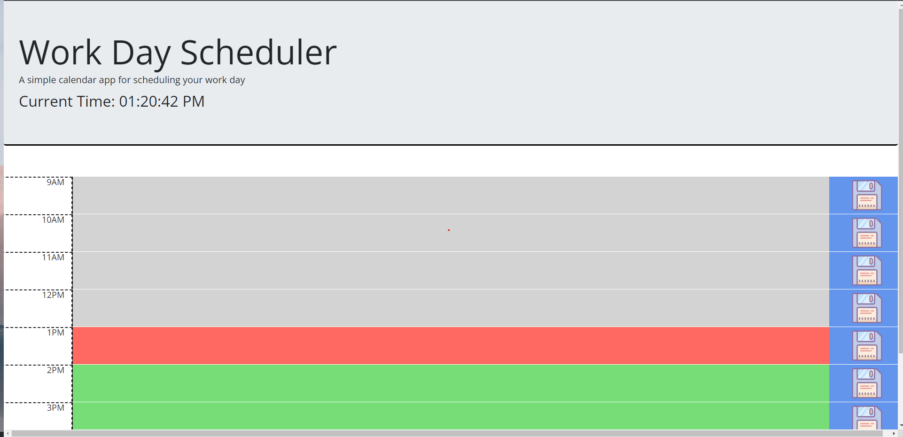

# Challenge05 - A simple calendar app for scheduling your work day

<h1>Description</h1> 
A scheduler for planning your day.

Text can be entered into the grey text areas and saved by clicking the save icon to the right. Saved text will be loaded upon refreshing or revisiting the page. The text areas will be colored grey for past, red for present, and green for future hours

<h1>Credits,</h1> 
Save icon from https://icons8.com/icon/XTU9VXM4oKaX/save

<h1>Live page</h1> 
Live deployed version of the site can be found at https://tekdahl92.github.io/Challenge05/